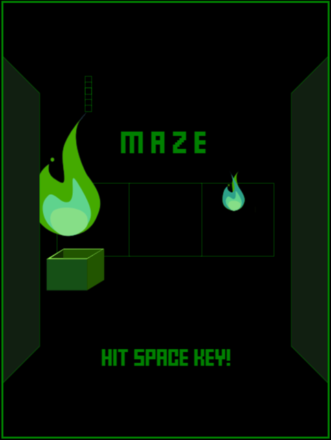

maze 👻
========
Programming 3D maze retoro mini game in Rust & WebAssembly

[](https://myurioka.github.io/maze/)

[Play in browser](https://myurioka.github.io/maze)

### How to play (Control)

  * Left or Right key : Change direction
  * Up key : Go forward
  * Down key : Go backward
  * Space key : Operates in a specific environment

### Requirement
  * Rust, Cargo
  * WASM

### How to Build & Run

  ```sh
  $ cd maze
  $ pnpm build-wasm
  $ pnpm dev --open
  ```

  Browse http://localhost:5173